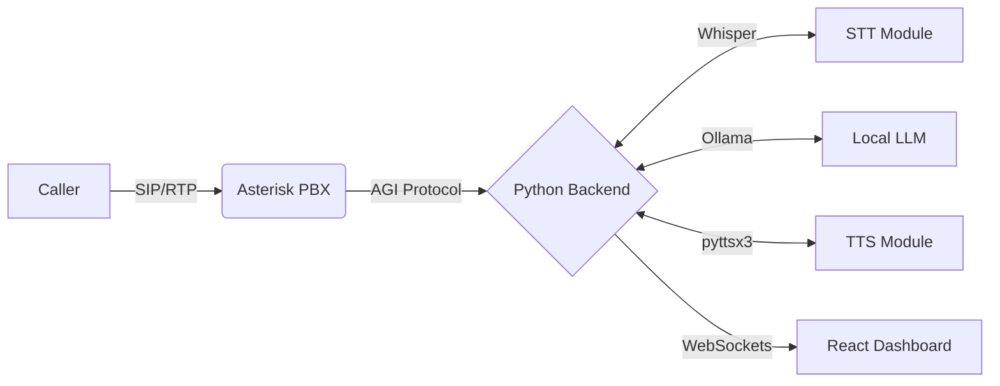

<div align="center">
  
# 🎧 Free AI Agent Call Center

[](https://www.python.org)
[](https://fastapi.tiangolo.com)
[](https://reactjs.org/)
[](https://www.asterisk.org/)
[](https://ollama.ai/)
[](https://opensource.org/licenses/MIT)

**A complete, production-ready AI Call Center built entirely on free and open-source tools.** <br>
*Zero API costs | Local Processing | Real-Time Dashboard*

</div>

---

## 🌟 Overview

This project provides a robust architecture for an AI-powered customer service call center. It intercepts live voice calls via **Asterisk PBX**, converts speech to text locally using **Whisper**, processes intentions with **Ollama (Llama 2)**, and speaks back natively using **pyttsx3**. Everything is tied together with an intuitive **React/Vite dashboard** to monitor real-time conversations.

### ✨ Key Features
- **Cost-Free Architecture:** No expensive API dependencies (runs models locally).
- **Offline Capable AI:** STT & LLMs are fully containerized/local.
- **Real-Time Monitoring:** Live interactive dashboard for tracking call metrics and transcripts.
- **Multi-Call Handling:** Robust Postgres/Redis queuing system via FastAPI.

---

## 🏗️ Architecture



## 📂 Repository Structure

```tree
ai-call-center/
├── asterisk_config/       # Configs to drop into /etc/asterisk
│   ├── extensions.conf    # Dialplan configuration
│   └── sip.conf           # SIP trunk and authentication
├── backend/               # Core intelligence layer
│   ├── agi_server.py      # Asterisk Gateway Interface listener
│   ├── main.py            # FastAPI & Websocket server
│   └── requirements.txt   # Python environment deps
├── frontend/              # Vite-powered React UI
├── setup.sh               # Master installation script
└── start_callcenter.sh    # Production runner script
```

---

## 🚀 Getting Started

> **Note:** Because this stack relies heavily on `Asterisk PBX` and specific package managers, it natively targets **Ubuntu/Linux**. Windows users should deploy via **WSL2** or a Linux Virtual Machine.

### 1. Prerequisites
Ensure you are on an Ubuntu-based system (or WSL2) with at least 4GB of RAM (required for running Whisper and Ollama concurrently).

### 2. Automated Installation
The included `setup.sh` handles installing system dependencies (Node.js, Python, Redis, Postgres), downloads Ollama models, and builds the frontend.

```bash
# Give execution permissions
chmod +x setup.sh start_callcenter.sh

# Run the master installer
sudo ./setup.sh
```

### 3. Setup Asterisk Configs
Copy the configured dialplans into Asterisk's system directory:
```bash
sudo cp asterisk_config/extensions.conf /etc/asterisk/extensions.conf
sudo cp asterisk_config/sip.conf /etc/asterisk/sip.conf
```

### 4. Start the Application
Boot up the Python Gateway and the REST API Dashboard:
```bash
./start_callcenter.sh
```

---

## 💻 Usage

1. **Monitor Calls:** Open your browser and navigate to `http://localhost:8000` to view the command center.
2. **Make a Test Call:** Connect any Standard SIP Softphone (like X-Lite, MicroSIP, or Zoiper) using:
   - **Host Interface:** `localhost`
   - **Secret:** `password123` *(Defined in sip.conf)*

---

<div align="center">
  <i>Built to democratize Call Center Intelligence.</i>
</div>
